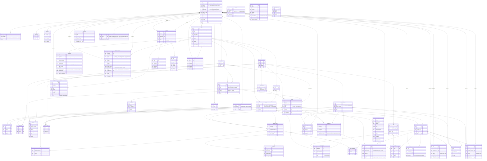

```mermaid
erDiagram
    users ||--o{ students : ""
    users ||--o{ teachers : ""
    users ||--o{ admins : ""
    users ||--o{ representatives : ""
    users ||--o| siga_staffs : ""
    users ||--o| addresses : ""
    students ||--o{ student_representatives : ""
    representatives ||--o{ student_representatives : ""
    users ||--o{ schools : "registrado_por"
    schools ||--o| subscriptions : ""
    schools ||--o{ subscription_payments : ""
    users ||--o{ subscription_payments : "revisado_por"
    users ||--o{ subscription_payments : "reportado_por"
    schools ||--o{ academic_periods : ""
    teachers ||--o{ grades : "coordinator_teacher"
    schools ||--o{ grades : ""
    teachers ||--o{ sections : "leader_teacher"
    grades ||--o{ sections : ""
    bell_schedules ||--o{ sections : ""
    academic_periods ||--o{ sections : ""
    schools ||--o{ departments : ""
    departments ||--o{ subjects : ""
    schools ||--o{ subjects : ""
    grades ||--o{ grade_subjects : ""
    subjects ||--o{ grade_subjects : ""
    academic_periods ||--o{ bell_schedules : ""
    bell_schedules ||--o{ time_slots : ""
    academic_periods ||--o{ lessons : ""
    teachers ||--o{ lessons : ""
    subjects ||--o{ lessons : ""
    sections ||--o{ enrollments : ""
    students ||--o{ enrollments : ""
    teachers ||--o{ teacher_sections : ""
    sections ||--o{ teacher_sections : ""
    subjects ||--o{ teacher_sections : ""
    academic_periods ||--o{ evaluation_moments : ""
    evaluation_moments ||--o{ competencies : ""
    subjects ||--o{ competencies : ""
    sections ||--o{ competencies : ""
    evaluation_activities ||--o{ indicators : ""
    competencies ||--o{ indicators : ""
    subjects ||--o{ evaluation_activities : ""
    sections ||--o{ evaluation_activities : ""
    evaluation_moments ||--o{ evaluation_activities : ""
    competencies ||--o{ activity_competencies : ""
    evaluation_activities ||--o{ activity_competencies : ""
    evaluation_activities ||--o{ activity_grades : ""
    students ||--o{ activity_grades : ""
    evaluation_moments ||--o{ moment_grades : ""
    enrollments ||--o{ moment_grades : ""
    subjects ||--o{ moment_grades : ""
    enrollments ||--o{ final_grade_books : ""
    subjects ||--o{ final_grade_books : ""
    enrollments ||--o{ attendances : ""
    users ||--o{ attendances : "recorded_by"
    users ||--o{ attendances : "justificada_por"
    users ||--o{ report_cards : "issued_by"
    users ||--o{ report_cards : "liberado_por"
    evaluation_moments ||--o{ report_cards : ""
    enrollments ||--o{ report_cards : ""
    users ||--o{ section_closures : "cerrado_por"
    evaluation_moments ||--o{ section_closures : ""
    sections ||--o{ section_closures : ""
    enrollments ||--o{ constancias : ""
    users ||--o{ constancias : "issued_by"
    enrollments ||--o{ informes : ""
    evaluation_moments ||--o{ informes : ""
    users ||--o{ informes : "escrito_por"
    academic_periods ||--o{ fees : ""
    enrollments ||--o{ charges : ""
    fees ||--o{ charges : ""
    payment_reports ||--o{ charges : ""
    users ||--o{ payment_reports : "revisado_por"
    representatives ||--o{ payment_reports : ""
    schools ||--o{ importaciones : ""
    users ||--o{ importaciones : "subido_por"
    academic_periods ||--o{ importaciones : ""
    users ||--o{ mensajes : "remitente"
    users ||--o{ mensajes : "destinatario"
    mensajes ||--o{ mensaje_eventos : ""
    mensajes ||--o{ mensajes_entrantes : ""
    schools ||--o{ activity_logs : ""
    users ||--o{ activity_logs : ""
    users ||--o{ siga_settings : "actualizado_por"
    users ||--o{ setup : "actualizado_por"

    users {
        int8 id PK
        texto email UK "opcional — un niño de 8 años no tiene"
        texto document UK "cédula, pasaporte o carné; único GLOBAL"
        texto first_name
        texto last_name "el PRIMER apellido — es el que valida el SAIME"
        int document_type "cuál de los cuatro que acepta el MPPE"
        texto cedula_escolar UK "la asigna el MPPE; acompaña al alumno de plantel"
        texto second_last_name
        date birth_date
        int sex
        texto birth_place
        texto birth_country
        texto birth_state
        texto birth_municipality
        texto rif UK
    }
    students {
        int8 user_id FK
        texto school_card "el carnet del plantel; único POR COLEGIO"
        int8 school_id FK
        int8 id PK
    }
    teachers {
        int8 user_id FK
        int8 school_id FK
        int8 id PK
    }
    admins {
        int8 user_id FK
        int8 school_id FK
        int role "director · asistente · coordinador · finanzas · secretaria"
        int8 id PK
    }
    representatives {
        int8 id PK
        int8 user_id FK
        int8 school_id FK
        texto phone
    }
    siga_staffs {
        int8 id PK
        int8 user_id FK
        int role
    }
    addresses {
        int8 id PK
        int8 user_id FK
        texto estado
        texto municipio
        texto parroquia
        texto location
        texto additional
    }
    student_representatives {
        int8 id PK
        int8 representative_id FK
        int8 school_id FK
        int parentesco
        boolean principal
        int8 student_id FK
    }
    schools {
        int8 id PK
        texto dea_code UK "lo asigna el MPPE; único global"
        texto name
        texto location
        texto entidad_federal
        texto municipio
        texto direccion
        texto telefono
        texto cdcee
        texto parroquia
        jsonb pasos_omitidos "lo ÚNICO que el arranque guarda"
        int8 registrado_por_id FK
        int tope_de_arrastre "materias pendientes que aún promueven — 2"
    }
    subscriptions {
        int8 id PK
        int8 school_id FK
        int plan "gratis · por_alumno — un solo plan, sin nombres"
        int status
        int matricula_facturada
        numeric precio_mensual
        date vigente_desde
        date vigente_hasta "el día que vence; de ahí, 15 de gracia y solo lectura"
        int dias_de_gracia
        text notas
        numeric precio_por_alumno "CONGELADO al activarse — el que entró a 0,35 sigue a 0,35"
        numeric minimo_mensual
        int aviso_enviado
        date aviso_del_vencimiento
    }
    subscription_payments {
        int8 id PK
        int8 school_id FK
        int8 reportado_por_id FK
        texto medio "pago_movil · binance · paypal · efectivo — da la unidad del monto"
        numeric monto "lo que dice el comprobante: Bs o dólares, según el medio"
        texto referencia
        date pagado_el
        text nota
        int alumnos
        numeric precio_por_alumno
        numeric minimo_mensual
        numeric precio_mensual "la cuenta con que se REPORTÓ, congelada"
        texto estado "en_revision · validado · rechazado — uno en revisión a la vez"
        int8 revisado_por_id FK
        fecha revisado_el
        text motivo
        date cubre_desde "el mes que pagó, escrito al validar"
        date cubre_hasta
    }
    academic_periods {
        int8 id PK
        int8 school_id FK
        texto name
        date start_date
        date end_date
    }
    grades {
        int8 id PK
        texto name "lo fija el Reglamento de la LOE — son quince"
        int level "DEDUCIDO del nombre, no capturado"
        int8 school_id FK
        int escala "numérica 1-20 · literal A-E"
        int8 coordinator_teacher_id FK "opcional — coordina a los guías, NO pasa lista"
        int orden
    }
    sections {
        int8 id PK
        int8 grade_id FK
        int8 academic_period_id FK
        int capacity
        texto name "A · B · U1 — corto y en MAYÚSCULA"
        texto classroom
        int8 school_id FK
        int8 leader_teacher_id FK "el profesor guía — SÍ pasa lista"
        int8 bell_schedule_id FK
        fecha timetable_published_at
    }
    departments {
        int8 id PK
        int8 school_id FK
        texto name
    }
    subjects {
        int8 id PK
        texto code "MAT · CAS · FIS; único por colegio"
        texto name "MAYÚSCULA en la base, Tipo Título en pantalla"
        int8 department_id FK
        int8 school_id FK
        int escala "opcional: pisa la del grado"
    }
    grade_subjects {
        int8 id PK
        int8 grade_id FK
        int8 subject_id FK
        int8 school_id FK
        int weekly_hours
    }
    bell_schedules {
        int8 id PK
        int8 school_id FK
        int8 academic_period_id FK
        texto name
    }
    time_slots {
        int8 id PK
        int8 school_id FK
        int8 bell_schedule_id FK
        int starts_min
        int ends_min
        int kind
    }
    lessons {
        int8 id PK
        int8 school_id FK
        int8 academic_period_id FK
        int8 section_id FK
        int8 subject_id FK
        int8 teacher_id FK
        int8 time_slot_id FK
        int day
        int starts_min
        int ends_min
    }
    enrollments {
        int8 id PK
        int8 section_id FK
        date enrollment_date
        int status "regular · retirado"
        int8 school_id FK
        int8 student_id FK
    }
    teacher_sections {
        int8 id PK
        int8 section_id FK
        int8 subject_id FK
        int8 school_id FK
        int8 teacher_id FK
    }
    evaluation_moments {
        int8 id PK
        texto name "I · II · III Lapso — SIN peso (Art. 111)"
        int8 academic_period_id FK
        int8 school_id FK
        date starts_on
        date ends_on
    }
    competencies {
        int8 id PK
        int8 school_id FK
        int8 section_id FK
        int8 subject_id FK
        int8 evaluation_moment_id FK
        text descripcion "prosa del docente, tal cual la escribió"
        text descripcion_canonica "sin acentos y en minúscula, SOLO para el índice único"
        int orden
    }
    indicators {
        int8 id PK
        int8 school_id FK
        int8 competency_id FK
        text descripcion "describe la competencia; NO se califica"
        text descripcion_canonica
        int orden
        int8 evaluation_activity_id FK
    }
    evaluation_activities {
        int8 id PK
        int8 subject_id FK
        int8 section_id FK
        int8 evaluation_moment_id FK
        texto description
        numeric weight_percentage "el 70/30 del Art. 111"
        date date_scheduled
        int8 school_id FK
    }
    activity_competencies {
        int8 id PK
        int8 school_id FK
        int8 competency_id FK
        int8 evaluation_activity_id FK
    }
    activity_grades {
        int8 id PK
        int8 evaluation_activity_id FK
        numeric score "entero del 1 al 20 — Art. 108"
        int8 school_id FK
        int8 student_id FK
    }
    moment_grades {
        int8 id PK
        int8 enrollment_id FK
        int8 subject_id FK
        int8 evaluation_moment_id FK
        numeric final_moment_score
        int8 school_id FK
        int origen "calculada · importada"
        text descripcion
    }
    final_grade_books {
        int8 id PK
        int8 enrollment_id FK
        int8 subject_id FK
        numeric annual_average "promedio SIMPLE de los lapsos — Art. 111"
        numeric remedial_exam_score "la reparación — Art. 112, es la definitiva"
        numeric final_score
        text comments
        int8 school_id FK
        int origen "calculada · importada — la importada no se recalcula"
    }
    rubrics {
        int8 id PK
        int8 school_id FK
        texto code "PC · PA · PI · PD · NP — lo que se imprime"
        texto name
        text description
        int valor "el PISO de la banda, no el tope"
    }
    attendances {
        int8 id PK
        int8 school_id FK
        int8 enrollment_id FK
        int8 recorded_by_id FK
        date date
        int status "presente · ausente · tarde"
        text justificacion
        fecha justificada_en
        int8 justificada_por_id FK
    }
    report_cards {
        int8 id PK
        int8 school_id FK
        int8 enrollment_id FK
        int8 evaluation_moment_id FK
        texto code UK "el que verifica el QR"
        jsonb snapshot "CONGELADO al emitir"
        int8 issued_by_id FK
        fecha liberado_el
        int8 liberado_por_id FK
    }
    section_closures {
        int8 id PK
        int8 school_id FK
        int8 section_id FK
        int8 evaluation_moment_id FK
        int8 cerrado_por_id FK
        fecha cerrado_el
    }
    constancias {
        int8 id PK
        int8 school_id FK
        int8 enrollment_id FK
        int8 issued_by_id FK
        texto code UK "único GLOBAL: se teclea en /verificar sin sesión"
        jsonb snapshot "lo que decía el papel el día que se emitió"
    }
    informes {
        int8 id PK
        int8 school_id FK
        int8 enrollment_id FK
        int8 evaluation_moment_id FK
        int8 escrito_por_id FK
        text cuerpo
    }
    fees {
        int8 id PK
        int8 school_id FK
        int8 academic_period_id FK
        texto nombre
        numeric monto
        date vence_el
        int orden
    }
    charges {
        int8 id PK
        int8 school_id FK
        int8 enrollment_id FK
        int8 fee_id FK
        numeric monto
        date vence_el
        fecha pagado_el
        int8 payment_report_id FK
    }
    payment_reports {
        int8 id PK
        int8 school_id FK
        int8 representative_id FK
        texto referencia
        texto banco
        numeric monto
        date pagado_el
        texto depositante_nombre
        texto depositante_documento
        text nota
        texto estado
        int8 revisado_por_id FK
        fecha revisado_el
        text motivo
        jsonb cobros_declarados
        fecha corregido_el
    }
    importaciones {
        int8 id PK
        int8 school_id FK
        int8 subido_por_id FK
        int estado
        jsonb mapeo
        jsonb resultado
        texto nombre_del_archivo
        int filas_leidas
        int8 academic_period_id FK
        int tipo "matrícula · pensum · historial"
    }
    mensajes {
        int8 id PK
        int8 school_id FK
        int8 destinatario_id FK
        int8 remitente_id FK
        texto asunto
        text cuerpo
        texto correo "CONGELADO — a dónde fue de verdad"
        texto token UK
    }
    mensaje_eventos {
        int8 id PK
        int8 school_id FK
        int8 mensaje_id FK
        texto tipo "enviado · abierto · rebotó"
        fecha ocurrio_en
        jsonb detalle
    }
    mensajes_entrantes {
        int8 id PK
        int8 school_id FK
        int8 mensaje_id FK
        texto de
        texto asunto
        text cuerpo
        fecha recibido_en
        fecha leido_en
        jsonb crudo
    }
    activity_logs {
        int8 id PK
        int8 user_id FK
        texto action
        texto message
        int8 subject_id FK "polimórfico: NO apunta a subjects"
        jsonb metadata
        texto ip_address
        int8 school_id FK
    }
    demo_requests {
        int8 id PK
        texto name
        texto email
        texto institution
        texto phone
        text message
        int status
        int current_system "qué sistema usa hoy el colegio"
        texto current_system_detail
        int veces
        texto telefono_normalizado
    }
    siga_settings {
        int8 id PK
        texto titular
        texto documento
        texto pago_movil_banco
        texto pago_movil_telefono
        texto cuenta "veinte dígitos; el banco, los cuatro primeros"
        int8 actualizado_por_id FK
    }
    setup {
        int8 id PK
        texto nombre UK "whatsapp · url_de_la_muestra · binance · paypal — solo los que el código conoce"
        text valor "vacío es «no hay»: sin WhatsApp no hay botón ni efectivo"
        int8 actualizado_por_id FK
    }
    planteles_oficiales {
        int8 id PK
        texto dea_code
        texto nombre
        texto entidad_federal
        texto busqueda
        texto municipio
    }
```
